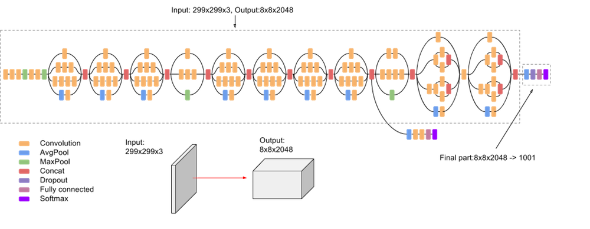

# Cervical Mucus AI Model

## The Project

The goal of this model is to generate a positive impact on couples seeking pregnancy, through the study of the fertile window of women based on the recognition of Images through Artificial Intelligence techniques, as well as through studies of the affectation of various fertility factors in couples.

The main advantage of studying the fertile window through cervical mucus using artificial technology is that the development of this technological tool makes it possible to automate the process of identifying women in their fertile window and serve as a support tool for the medical institution to facilitate and expand the diagnosis and decision-making on patients related to the fertile status of women.

### Product and Patent

The final product consist of an online tool, accessible from the WOOM apps, which offers women the possibility of uploading a photograph of their cervical mucus along with personal data relevant to the model (which we will call "user features"), so that the algorithm analyzes it and returns a result automatically.

This algorithm consists of a composition of mathematical models and tools that, together, will issue the appropriate response (if the woman is in her fertile window of her cycle or not). Specifically, it will consist of two main layers:

1. The first layer will be responsible for classifying the user according to their features (age, height, weight, eating/smoking/alcohol habits, cycle length, medical and menstrual history, etc...), based on which new mathematical features will be created (distances between points, clustering/segmentation, embeddings, etc...). All of these features (existing and generated) will be used to feed the second layer along with the cervical mucus image.

2. This second layer is a convolutional neural network capable of identifying patterns in the composition of the image (viscosity, texture, etc...) in order to identify the degree of fertility or the probability that the photographed cervical mucus corresponds to a woman who is within the fertile window of her cycle. The novelty of this network is its ability to consume the features of the previous layer, so that these form part of its predictive capacity and, therefore, make it a much more effective tool.

On the other hand, the response of our model does not only consist of a binary response, but will also be made up of 2 differentiated elements:

1. Obviously, the result of the model, which would be represented by a yes or a no, depending on whether or not the probabilities that the network has given are above a certain threshold.

2. At its exit, the model will be able to show the user a series of filters applied to the image that identify those characteristics of the image that the model has considered significant to obtain its result.

These answers is shown to the user on the screen in a matter of seconds, so that she obtains the information she needs to continue with her pregnancy search process. In addition, the entire model is being continuously trained, so it continues to learn as new images, data, and labels are fed to it.

It is for all this that we are facing an innovative and patentable product, which represents a pioneering method to help women and medical personnel to identify the most fertile days of a woman, as well as allowing them to be able to determine what day is the most suitable for having intercourse and for the desired pregnancy to occur.

## The Model

The model consists of 2 layers of algorithms and a final meta-model trained with the aggregated results of the previous ones. The scheme is as follows:

As the main subfield of Artificial Intelligence, the use of CNN (Convolutional Neural Networks) has been chosen within the field of computer vision. CNNs are very effective for artificial vision tasks, such as image classification and segmentation, being able to detect patterns and axes within images.

They have their foundation on biological neurons:

The goal of our model is to classify the fertile status of the user, taking into account as characteristics such as the elasticity and transparency of the sample. From a photograph as input, the algorithm will be able to return a binary classification result.

The neural network model that we propose consists of the conjunction of 3 sublayers: a pre-trained model, an attention module and a conventional output layer.

### Pre-Trained Model

Through a technique known as "transfer learning", we take advantage of the power offered by the neural networks developed for the detection and classification of images by specialized teams and use them to serve as the basis of a personalized and specific model for our goal. These pre-trained networks are public for use and offer incredible results when it comes to detecting and differentiating some objects from others, all we need is to stack our own layer on top of it in order to allow the entire network to learn the characteristics of the specific objects we are trying to classify.

In our case, we have selected a network called "Inception", whose model adapts perfectly to our problem and is the one that has given the best results in our tests (made with real images).

### Attention Module

In transfer learning models, it is usual to place a final layer of neurons on top of the pre-trained network, in order to help it learn the details of the images we are trying to classify. But we went a little further and developed our own intermediate layer whose goal is to detect which areas of each image are really important to determine a result.

To do this, we analyze the image pixel by pixel and assign a specific weight to each one of them so that we obtain a visual heatmap with those areas to which we must pay attention (hence the name of the module) when examining an image. This is something that is sometimes applied to NLP (Natural Language Processing) and text recognition models, but in this case we have adapted it to our image classification model.

In convolutional neural networks, the output usually consists of a 3-dimensional tensor, corresponding to the height, width and channels of the trained image, which must be flattened to be accepted by the last conventional classification layer. To do this, it is usual to perform an operation called GAP (Global Average Pooling), which consists of flattening a convolutional tensor by calculating the mean of all the values of each channel or map. In this way, instead of taking all the tensor values, we group them by channel using the average of their values.

The novelty that we introduce is to apply our attention module, previously described, to the output of the convolutional network in order to detect those areas of the image that are most significant for the final result and to use the weights obtained to apply a weighted average (instead of arithmetic) when doing the pooling. Which converts the GAP (Global Average Pooling) process into a vitaminized GWAP (Global Weighted Average Pooling), capable of offering much more information in the output, with those important areas of the image highlighted.

The output of this attention module will be used to feed the conventional layer of our model, but it will also serve to generate the filters and images that will be shown to the user as an explanatory method of the result.

### Conventional Layer

Finally, once we have gone through the pre-trained network and the attention module, we apply a last layer that reduces the output to a sigmoidshaped response (between 0 and 1), depending on the degree of certainty that the model has about whether the image corresponds to a woman in the fertile or infertile period.

The novelty present in this conventional layer is the use of a specific activation function in the intermediate layers, adapted from some "reinforcement learning" models, called TanhSoft. This function has the ability to improve the performance of the most common ones (Tanh, ReLU, LeakyReLU, Swish, …), avoiding the typical problems related to gradient fading and, moreover, being parameterizable, so that we can adjust it to our specific needs.

### Overall

The complete neural network is then assembled from these 3 large layers and, basically, it would have the form described here:

## Results

This is the evaluation score of the model on the test set, using the ROC AUC score as metric and a 5-fold cross-validation approach:

A more detailed set of evaluation results showing also the precission-recall curve and the confusion matrix:

## Notebook

Try the Jupyter notebook [`CervicalMucusCV.ipynb`](./CervicalMucusCV.ipynb) for a step-by-step guide and visualization of the model results.

## Author

This model was created by [Luis Sancho](https://github.com/luissancho).
